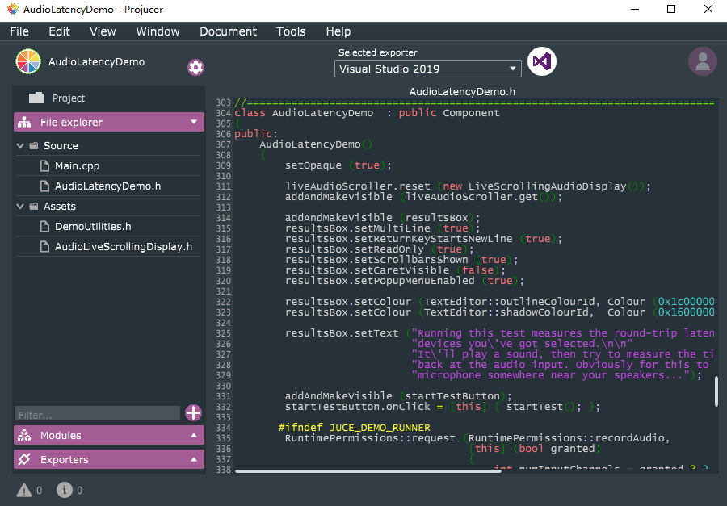
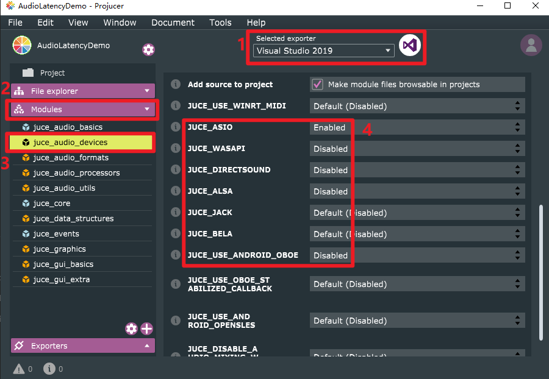
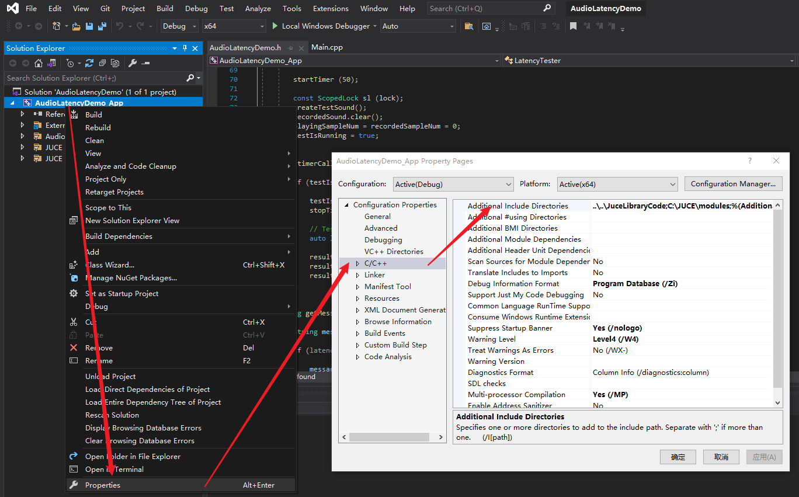
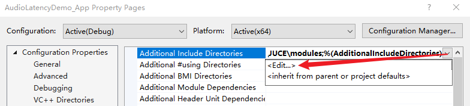
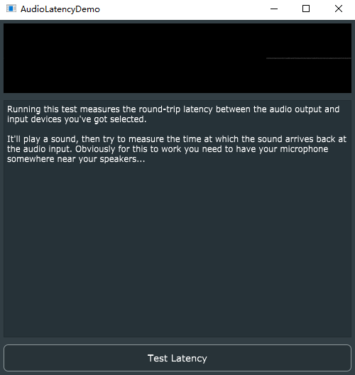
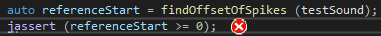

# The Easiest Way for C++ Audio Programming on Windows with ASIO Driver

> **NOTE:** ASIO is only for Windows. Other platforms, e.g, Linux and MacOS, have their own audio API. We only provide the C++ tutorial for audio programming on Windows with ASIO. But the Juce library and Projucer mentioned in this document are also helpful for C++ programming on other platforms.

In this document, our goal is 
> To setup the C++ development environment for audio programming on Windows;   
> To build a demo of audio latency testing;   
> To compile and run the demo, and test the latency of your sound card.

---

## **Setup Development Environment**

There are three requirements. 

- Microsoft Visual Studio
- ASIO Driver and SDK
- JUCE Library and Projucer

---

### **1. Install Microsoft Visual Studio**

> Reference: [Install Visual Studio](https://docs.microsoft.com/en-us/visualstudio/install/install-visual-studio?view=vs-2019)

Please follow the reference. In Step 4, choose **Desktop development with C++**.

### **2. Install ASIO Driver**
- Download and install ASIO4ALL. ([Dwonload ASIO4ALL](https://www.asio4all.org/))

- ASIO4ALL is an ASIO driver, but ASIO SDK is also required to develop program using this driver. You can download it [here](https://www.steinberg.net/asiosdk?_ga=2.181482535.1213396426.1628605397-17686232.1628605397). Decompress the .zip file and remember the location of the folder. It will be used to configure the VS project.

> **If you want to know more about ASIO and audio programming on other platforms, following material may be helpful.** 
> 1. [A Brief History of Windows Audio APIs](http://shanekirk.com/2015/10/a-brief-history-of-windows-audio-apis/)  
> 2. [How Linux Audio Works vs. Windows Audio in 2017](https://www.learndigitalaudio.com/how-linux-audio-works-vs-windows-audio-2017) 
> 3. [What is ASIO4ALL? Can You Get ASIO4ALL on a Mac?](https://musicianshq.com/what-is-asio4all-can-you-get-asio4all-on-a-mac/) (This title is confusing. The conclusion is that ASIO is not necessary for Mac. The built-in audio driver, e.g., Core Audio, is good enough.)

### **3. Download Juce and Projucer**
> Reference: [https://juce.com/](https://juce.com/)

- You can download them [here](https://juce.com/get-juce/download). Decompress the .zip file.

### **4. Run the AudioLatencyDemo**
- In the JUCE folder, execute Projucer.exe. You will see the GUI of it.

   

- Open AudioLatencyDemo. Click File -> Open Example -> Audio -> AudioLatencyDemo

   

 
 

- Select your exporter. (1)
- Select ASIO audio API. (2-4)

   

- Open this project in your IDE.

   

- Now, the AudioLatencyDemo project is opened in VS. The dependencies of this project are  all configured, except the directory to ASIO SDK. If you compile it, an error will be reported,
  > fatal error C1083: Cannot open include file: 'iasiodrv.h': No such file or directory (compiling source file ..\..\JuceLibraryCode\include_juce_audio_devices.cpp)

    You need to configure it as shown in following figures. The path to "**common**" folder of ASIO SDK could be obtained in **Step 2. Install ASIO Driver**.

   

 
 

 
 

- It is ready to compile the project. If the project is built successfully, following application will run and an icon of ASIO driver (  ) will appear in the task bar.

   

- Click  and enter the configuration UI. Select your preferred sound card. I select **C-MEDIA USB Audio Device** according to the UGREEN sound card adapter. This is the device you will use for the Project 2-4. 

   

---

## Some Bugs

1. Cannot find the Spikes of the testSound (Output Sound).

   

This is caused by a wrong initialized sample rate (8000 Hz) while the correct sample rate is 44.1 kHz or 48 kHz. Temporarily, if you meet this problem, just modify the code of **Line 129** in **AudioLatencyDemo.h**
        
    sampleRate = device->getCurrentSampleRate();

to

    sampleRate = 48000; // or 44100
