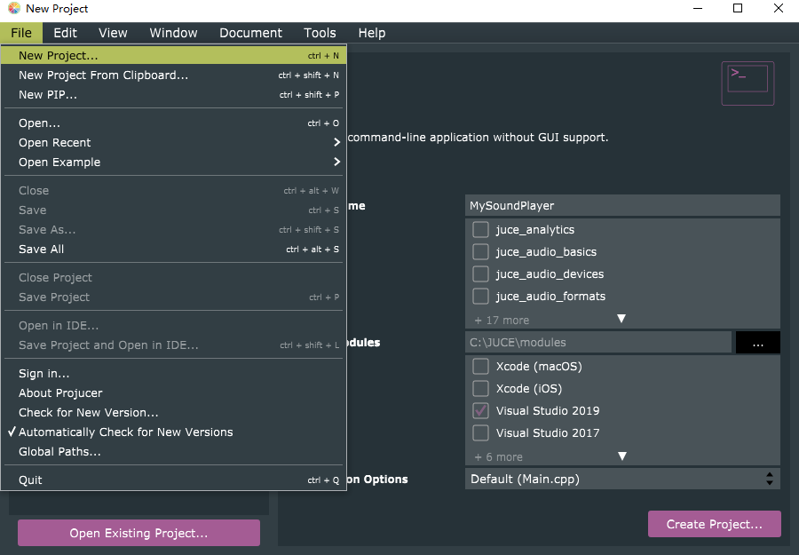
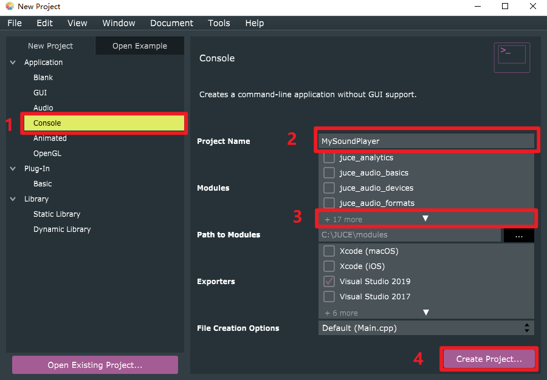
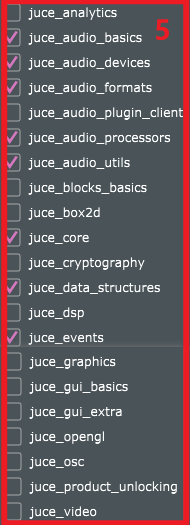

# Write a Sine Wave Player

In this document, our goal is 
> To know the audio programming related JUCE class. <br/> 
> To learn how to use JUCE library to write a sine wave player.

---

## Create a Console Project

In Tutorial 1, we create an AudioLatencyDemo, which is a GUI application. The code of the audio programming hides in the GUI codes. It is a good material to learn how to play and record sound. But, for a beginner, it is confusing. Thus, in this tutorial, we will create a console project and present the core code of playing sound.

To create a console project, you should click **File -> New Project**
<div  align="center">   

</div>

Then, 

(1) Select **Console**. 

(2) Name your project. 

(3) Click it and Select the modules as shown in (5). 

(4) Click **Create Project**.

<div  align="center">  


</div>

After that, refer to Tutorial 1 for project configuration. 

Finally, copy the example code in **player_example.cpp** to **Main.cpp** of the project.

---

## Audio Related Classes

Now, we will explain the example code. It relates two class, [AudioDeviceManager](#AudioDeviceManager) and [AudioIODeviceCallback](#AudioIODeviceCallback)

<h3 id="AudioDeviceManager">1. AudioDeviceManager </h3>
This is the core class for audio programming in JUCE. It manages the state of audio devices and automatically track the I/O data. To play some sound, you first initialize the AudioDeviceManager with an audio device. Then you may configure the device in use. Finally, add an AudioIODeviceCallback to the AudioDeviceManager. The AudioIODeviceCallback class is overridden by you to specify how to process the input and output data.

- Example code
    ```cpp
    // Initialization and Setup
    AudioDeviceManager dev_manager;
    dev_manager.initialiseWithDefaultDevices(1,1);
    AudioDeviceManager::AudioDeviceSetup dev_info;
    dev_info = dev_manager.getAudioDeviceSetup();
    dev_info.sampleRate = 48000;
    dev_manager.setAudioDeviceSetup(dev_info, false);

    // Override AudioIODeviceCallback
    class PlayTester : public AudioIODeviceCallback { ... }

    // Add PlayTester to AudioDeviceManager
    std::unique_ptr<PlayTester> playTester;
    if (playTester.get() == nullptr) {
        playTester.reset(new PlayTester());
        dev_manager.addAudioCallback(playTester.get());
    }
    ```
- Explanation
    > Refer to the document of JUCE. [AudioDeviceManager](https://docs.juce.com/master/classAudioDeviceManager.html) <br/>
    > Main functions: [initialiseWithDefaultDevices](https://docs.juce.com/master/classAudioDeviceManager.html#aed646db44c76466d8d0e288d56e50691), [getAudioDeviceSetup](https://docs.juce.com/master/classAudioDeviceManager.html#a84855d2826ebd28f1bb61fb77005fb7a), [setAudioDeviceSetup](https://docs.juce.com/master/classAudioDeviceManager.html#aef0249d178aa5448ad2e949ae059c461), [addAudioCallback](https://docs.juce.com/master/classAudioDeviceManager.html#acf3977dcc83f22b7f51091d7ff7b8aff).

<h3 id="AudioIODeviceCallback">2. AudioIODeviceCallback </h3>

This I/O callback class should be added to AudioDeviceManager, which tell the AudioDeviceManager how to process the input/output data.

- Example Code: Play a 9000 Hz sine wave voice.
    ```cpp
    // Override AudioIODeviceCallback
    class PlayTester : public AudioIODeviceCallback { 

        void audioDeviceIOCallback(const float** inputChannelData, 
                                    int numInputChannels,
                                    float** outputChannelData,
                                    int numOutputChannels, 
                                    int numSamples) override {
            // Generate Sine Wave Data
            int freq = 9000; // Hz
            float amp = 0.7;
            int sampleRate = 48000;
            int channelNum = 1;
            float dPhasePerSample = 2 * PI * ((float)freq / (float)sampleRate);
            float initPhase = 0;
            float data;

            for (int i = 0; i < numSamples; i++) {
                data = amp * sin(dPhasePerSample * i + initPhase);
                // Write the sample into the output channel 
                outputChannelData[0][i] = data;
            }
        }
    }
    ```
- Explanation
    > **void audioDeviceIOCallback()**: This function is automatically called by AudioDeviceManager to process data in the buffer.<br/>
    
    > **const float\*\* inputChannelData**:  inputChannelData[j][i] represents the i-th sample in j-th input channel. In this example, we initialize the device with one input channel and one output channel.<br/>

    > **int numInputChannels**: The number of input channel.<br/>

    > **float\*\* outputChannelData**: Similar to inputChannelData.<br/>

    > **int numOutputChannels**: The number of output channel.<br/>
    
    > **int numSamples**: The buffer size, i.e., the number of samples in each channel.<br/>

Note: We only provide the code to play sound, but the code of recording is similar. Recording should be also implemented in **audioDeviceIOCallback**. The player writes data into **outputChannelData**, while the recorder reads data from **inputChannelData**

---

## Some Bugs

- When switch the sound card in ASIO4ALL driver, the process is broken. It seems caused by failure of resetting the main thread. The solution has not been found, but you can do one switch per breakdown. For example, run, turn off device A, breakdown, run, turn on device B, breakdown, run, done. If you find any solution, you are welcome to share with us.
