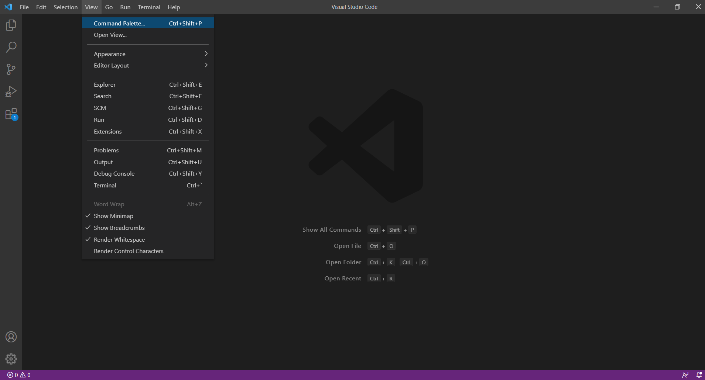
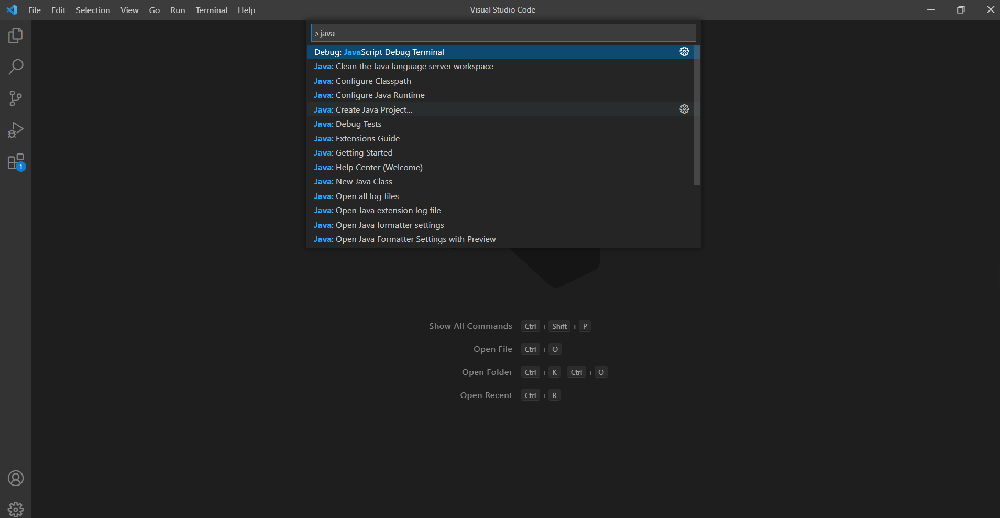
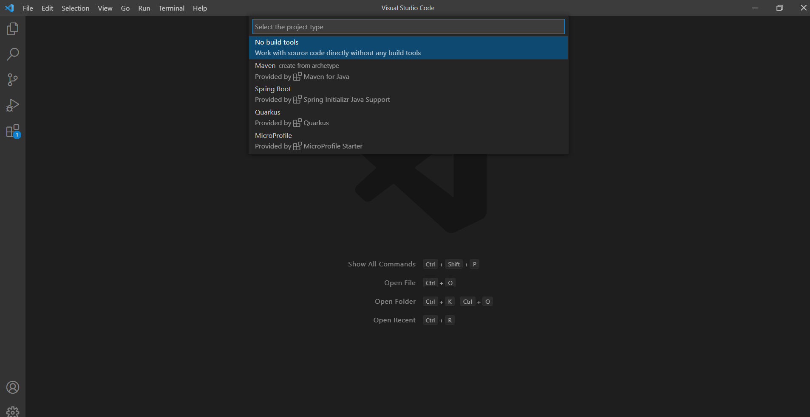

# Write a Sine Wave Player with JAVA and JAsio

In this document, our goal is 
> To learn how to use JAsio library to write a sine wave player.

---
## Create a Project

You can use VsCode to create your project 

To create a new project, you should click **View -> command palette**
<div  align="center">   

</div>

Then, enter keyword `java` 

(1) Select **create java project**. 
<div  align="center">   

</div>

(2) Select **No Building Tools**. 
<div  align="center">   

</div>

(3) Name your project.

The new java project is created
<div  align="center">   

</div> 


After that, copy the file **.classpath** and **.project** to the new project.

Finally, copy the example code in **AudioHw.java** to **APP.java** of the project. Copy the file **Config.java** to `src` directory.

---
## Prepared
JAsioHost consists of two parts. 

`JAsioHost.jar` is the usual encapsulation of the classes comprising the JAH Java library, and `jasiohost.dll` is the JAH interface to ASIO. The package of JAH is `com.synthbot.jasiohost`.

1. Include `JAsioHost.jar` in your Java project. Make `jasiohost.dll` available to your project. This can be done in several ways:
  (1) Move or copy the library to `C:\WINDOWS\system32`. This is the default search location for JNI libraries.
  (2) Inform the JVM where the library is located. This can be done with, e.g. `java -Djava.library.path=C:\WINDOWS\system32`.

   If the JVM cannot find the dll, an [UnsatisfiedLinkError](http://docs.oracle.com/javase/1.4.2/docs/api/java/lang/UnsatisfiedLinkError.html) exception will be thrown.

2. Download the ASIO4ALL driver. (https://www.asio4all.org/)

---
## Example
```Java
//Sine wave
private float phase = 0;
private float freq = 5000f;  // Hz
private float sampleRate = 48000f;
private float dphase = (2 * (float)Math.PI * freq) / sampleRate;

// initialization
public void init() {
  // create a Set of AsioChannels
  activeChannels = new HashSet<AsioChannel>();  

  if (asioDriver == null) {
    // load the names of ASIO driver
    asioDriver = AsioDriver.getDriver("ASIO4ALL v2");
    
    // add an AsioDriverListener in order to receive callbacks from the driver
    asioDriver.addAsioDriverListener(this);

    System.out.println("------------------");
    System.out.println("Output Channels");

    for (int i = 0; i < asioDriver.getNumChannelsOutput(); i++) {
      System.out.println(asioDriver.getChannelOutput(i));
    }
    outputChannel = asioDriver.getChannelOutput(0);

    output = new float[Config.HW_BUFFER_SIZE];

    asioDriver.setSampleRate(Config.PHY_TX_SAMPLING_RATE);
    /*
      * buffer size should be set either by modifying the JAsioHost source code or
      * configuring the preferred value in ASIO native window. We choose 128 i.e.,
      * asioDriver.getBufferPreferredSize() should be equal to Config.HW_BUFFER_SIZE
      * = 128;
      * 
      */

    // configure the ASIO driver to use the given channels
    activeChannels.add(outputChannel);

    // create the audio buffers and prepare the driver to run
    asioDriver.createBuffers(activeChannels);

    System.out.println("ASIO buffer created, size: " + asioDriver.getBufferPreferredSize());
  }
}

// start the driver
public void start() {
  if (asioDriver != null) {
    asioDriver.start();  
    System.out.println(asioDriver.getCurrentState());
  }
}

// stop the driver
public void stop() {
  asioDriver.returnToState(AsioDriverState.INITIALIZED);
  asioDriver.shutdownAndUnloadDriver();  
}

@Override
public void bufferSwitch(final long systemTime, final long samplePosition, final Set<AsioChannel> channels) {
  
  //fill audio buffers here
  for (int i = 0; i < Config.HW_BUFFER_SIZE; i++) {
    phase = phase + dphase;
    output[i] = (float) (Math.sin((double)phase));  // sine wave
  }

  for (AsioChannel channelInfo : channels) {
    channelInfo.write(output);
  }

}

@Override
public void latenciesChanged(final int inputLatency, final int outputLatency) {
  System.out.println("latenciesChanged() callback received.");
}

@Override
public void bufferSizeChanged(final int bufferSize) {
  System.out.println("bufferSizeChanged() callback received.");
}

@Override
public void resetRequest() {
  /*
    * This thread will attempt to shut down the ASIO driver. However, it will block
    * on the AsioDriver object at least until the current method has returned.
    */
  new Thread() {
    @Override
    public void run() {
      System.out.println("resetRequest() callback received. Returning driver to INITIALIZED state.");
      asioDriver.returnToState(AsioDriverState.INITIALIZED);
    }
  }.start();
}

@Override
public void resyncRequest() {
  System.out.println("resyncRequest() callback received.");
}

@Override
public void sampleRateDidChange(final double sampleRate) {
  System.out.println("sampleRateDidChange() callback received.");
}

```
Run your java code using the sound card. The output is a sine wave sound. 


## Reference
https://github.com/mhroth/jasiohost
